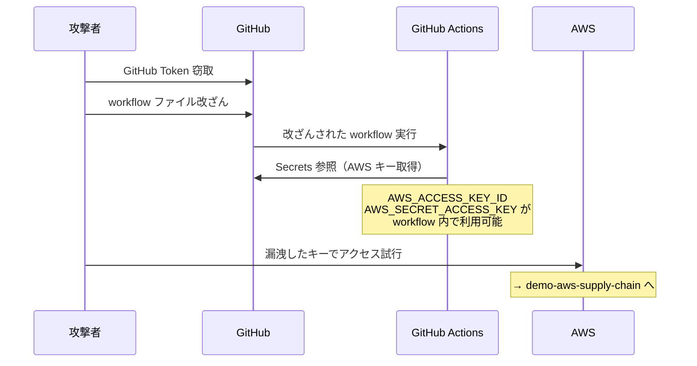
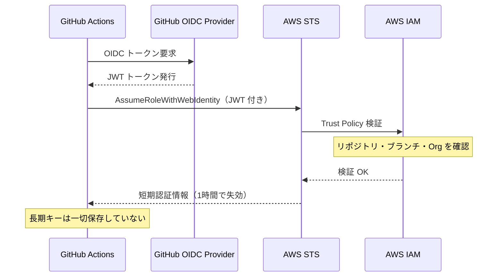

# GitHub Actions Secrets 漏洩 → OIDC 移行デモ

> **教育目的のみ。実際の攻撃には使用しないこと。**

## 概要

GitHub Actions に保存された AWS Secrets が漏洩するリスクと、OIDC による根本的な改善方法を学習するデモです。

**シナリオ**

1. [前提] メンテナーアカウントの侵害（PAT 窃取など）で GitHub への write 権限を取得する
2. [リスク] `.github/workflows/*.yml` を改ざんし、実行時に GitHub Secrets（AWS キー）を外部へ送出する
3. [改善] OIDC 方式では長期 AWS キーを GitHub Secrets に保存しない設計で根本対策できる

> **注意:** AWS キーが漏洩した後の侵害（S3 データ窃取・権限昇格など）は [demo-aws-supply-chain](https://github.com/st-hisatoshi-2973/demo-aws-supply-chain) で扱います。本デモは AWS キー漏洩まで（ステップ 2）に焦点を当てています。

```
[GitHub Repository]
  └─ GitHub Secrets に AWS_ACCESS_KEY_ID / AWS_SECRET_ACCESS_KEY を保存
        ↓ メンテナーアカウント侵害（PAT・SSH 鍵など）
  .github/workflows/*.yml を改ざん
        ↓ 次回 workflow 実行時（push / PR / schedule など）
  改ざんされたコードが Secrets にアクセス
        ↓
  AWS キーが攻撃者のエンドポイントへ流出
        ↓
  [demo-aws-supply-chain へ]
```

> **本リポジトリはサニタイズ版です。** 実際の秘密情報・外部通信・権限昇格コードは含まれていません。  
> workflow ファイルは `.yml.example` 形式で、GitHub Actions では実行されません。

---

## 第1部: Secrets 方式のリスク

### workflow 改ざんはどのように起きるか

GitHub Secrets の値は **設定画面から閲覧できない設計** になっています（名前のみ表示）。  
そのため攻撃は「workflow を改ざんして実行させ、注入された環境変数を外部へ送る」という間接的な手法を取ります。

workflow の改ざんは **メンテナーアカウントの侵害** によって発生します。

| 侵害ルート | 具体例 |
|---|---|
| PAT（Personal Access Token）窃取 | フィッシング、マルウェア、リポジトリへの直書き |
| SSH 鍵の窃取 | 開発端末への侵入 |
| GitHub App の不正利用 | 過剰な権限を持つ App を経由 |
| OAuth Token の窃取 | 悪意ある OAuth アプリへの誤認可 |

### 漏洩の流れ

```
メンテナーアカウント侵害
  ↓
.github/workflows/*.yml を改ざん（外部送信コードを追加）
  ↓
次回 workflow 実行時に改ざんされたコードが動く
  ↓
GitHub Secrets（AWS_ACCESS_KEY_ID / AWS_SECRET_ACCESS_KEY）が環境変数として注入される
  ↓
AWS キーが攻撃者の管理するエンドポイントへ流出
```

### Secrets 方式の構造的問題

```
┌─────────────────────────────────┐
│       GitHub Repository         │
│                                 │
│  Settings > Secrets             │
│  ┌─────────────────────────┐    │
│  │ AWS_ACCESS_KEY_ID       │    │  ← 長期キーを「保存」する設計
│  │ AWS_SECRET_ACCESS_KEY   │    │
│  └─────────────────────────┘    │
│                                 │
│  .github/workflows/deploy.yml   │
│    env:                         │
│      AWS_ACCESS_KEY_ID:         │  ← workflow が参照
│        ${{ secrets.AWS_... }}   │
└─────────────────────────────────┘
```

**根本的な問題**: 長期アクセスキーを「どこかに保存する」設計になっている。

### Mermaid 図: Secrets 方式の漏洩フロー



---

## 第2部: OIDC 方式（改善後）

OIDC（OpenID Connect）を使うと、**長期アクセスキーを発行しない設計** が実現できます。

```
GitHub Actions OIDC トークン（JWT）を自動発行
  ↓
AWS STS AssumeRoleWithWebIdentity
  ↓
IAM Role の Trust Policy でリポジトリ・ブランチを検証
  ↓
短期認証情報を発行（最大1時間で失効）
  ↓
長期 AWS キー不要 ← GitHub Secrets に保存するものがない
```

### OIDC 方式の構造

```
┌──────────────────────────────────────────┐
│            GitHub Actions                │
│                                          │
│  OIDC トークン（JWT）を自動発行            │
│  ※ Secrets に AWS キーは不要             │
└──────────────────┬───────────────────────┘
                   │ AssumeRoleWithWebIdentity
                   ▼
┌──────────────────────────────────────────┐
│                  AWS                     │
│                                          │
│  IAM Role の Trust Policy で検証          │
│  ・リポジトリ名の検証                      │
│  ・ブランチ名の検証                        │
│  ・Organization の検証                    │
│                                          │
│  → 短期認証情報を発行（最大1時間）          │
└──────────────────────────────────────────┘
```

### Mermaid 図: OIDC 方式のフロー



---

## Secrets 方式 vs OIDC 方式: 比較

| 比較項目 | Secrets 方式 | OIDC 方式 |
|---|---|---|
| 認証情報の種類 | 長期アクセスキー（無期限） | 短期トークン（最大1時間） |
| 保存場所 | GitHub Secrets | 保存しない |
| 漏洩時の影響 | キーが有効な限り悪用可能 | 短時間で失効 |
| ローテーション | 手動で必要 | 自動（毎回発行） |
| アクセス制御 | IAM Policy のみ | IAM Policy + Trust Policy（リポジトリ・ブランチ制限） |
| 本デモでの CloudTrail への記録 | `GetCallerIdentity` | `AssumeRoleWithWebIdentity` + `GetCallerIdentity` |
| 不正利用の追跡 | IAM ユーザー単位 | リポジトリ・ブランチ単位で追跡可能 |
| 設計思想 | 秘密を保存する | 秘密を保存しない |

---

## このデモが示すリスク

| リスク | 内容 |
|---|---|
| GitHub Token は GitHub だけの問題ではない | Token が漏洩すると、GitHub Secrets 経由で AWS キーまで到達できる |
| CI/CD はクラウド侵害につながる | CI/CD パイプラインは「クラウドへの入口」になっている |
| 長期キーは漏洩後もローテーションまで有効 | 気づかずに悪用され続けるリスクがある |
| 不正利用の痕跡が残りにくい | `GetCallerIdentity` は CloudTrail に記録されるが、IAM ユーザー単位の追跡しかできない |
| Secrets 方式は「保存する設計」である | どれだけ安全に保存しても、保存している限り漏洩リスクが残る |

---

## 対策

| 対策 | 内容 |
|---|---|
| OIDC 方式への移行 | 長期 AWS キーを発行しない設計に切り替える。本デモの第2部を参照 |
| メンテナーアカウントの保護 | MFA の有効化、PAT のスコープ・有効期限を最小化する |
| workflow の権限を最小化 | `permissions: contents: read` のみに絞り、不要な write 権限を与えない |
| CloudTrail の監視 | 異常なアクセスを検知する。[demo-aws-supply-chain](https://github.com/st-hisatoshi-2973/demo-aws-supply-chain) で EventBridge → Lambda → Slack の構成を確認できる |
| キーの即時ローテーション | 不審を感じたら即座に無効化・ローテーションする |

---

### OIDC ≠ 最小権限

OIDC は「**長期認証情報を保存しない**」ための仕組みです。
しかし、OIDC で取得した短期トークンは IAM Policy の範囲でリソースにアクセスできます。

```
OIDC で解決できること          OIDC だけでは解決できないこと
─────────────────────         ──────────────────────────────
✓ 長期キーの保存をなくす        △ 短期トークンの権限範囲
✓ キー漏洩リスクの低減          △ IAM Policy が広すぎると短期トークンでアクセスできる範囲が広がる
✓ 自動ローテーション            △ Trust Policy が緩いと意図しない workflow から Role を利用できる
```

そのため、以下の両方を最小権限で設計することが重要です。

| 設定 | 役割 | 最小権限の例 |
|---|---|---|
| **Trust Policy** | 誰がこの Role を引き受けられるか | 特定リポジトリ・特定ブランチのみ許可 |
| **IAM Policy** | 短期トークンで何ができるか | 必要な S3 バケットのみ、読み取り専用 |

---

## workflow サンプル・Terraform

実行可能ファイルとして `.github/workflows/` には置いていません。  
サンプルは `.yml.example` として保存しています。

- [vulnerable-version.yml.example](.github/workflows/vulnerable-version.yml.example) — Secrets 方式
- [oidc-version.yml.example](.github/workflows/oidc-version.yml.example) — OIDC 方式

実際に動作確認する場合は `.yml` にリネームして、検証専用の private リポジトリで実行してください。

### Terraform

OIDC 用 IAM Role・Secrets 方式検証用 IAM ユーザーを作成する Terraform サンプルを [terraform/](terraform/) に置いています。

#### 事前準備: Terraform 実行ユーザーへのポリシーアタッチ

Terraform を実行する IAM ユーザー/ロール（`terraform-demo` プロファイル）に [terraform/sample-policy.json](terraform/sample-policy.json) をアタッチしてください。

```bash
cd terraform/
cp terraform.tfvars.example terraform.tfvars
# terraform.tfvars を編集して以下を設定する:
#   github_org          : 自分の org/username
#   demo_s3_bucket_name : グローバルで一意な S3 バケット名

terraform init
terraform apply

# 検証後は必ず削除する
terraform destroy
```

> **注意:** 専用の検証用 AWS アカウントでのみ実行してください。  
> `terraform.tfstate` にアクセスキーが含まれるため、`.gitignore` で除外済みです。

---

## 関連リポジトリ

| リポジトリ | 内容 |
|---|---|
| **本リポジトリ** | GitHub Actions Secrets 漏洩 → OIDC 移行デモ |
| [demo-aws-supply-chain](https://github.com/st-hisatoshi-2973/demo-aws-supply-chain) | 漏洩した AWS キーによるリスク確認・CloudTrail 検知デモ |

> `demo-aws-supply-chain` では、AWS アクセスキーが漏洩した後に何が起きるか（S3 データ窃取・CloudTrail 検知）を学習できます。

---

## ライセンス・利用上の注意

本リポジトリはセキュリティ学習目的で作成されています。  
実際のシステムへの無断アクセスや攻撃には使用しないでください。
